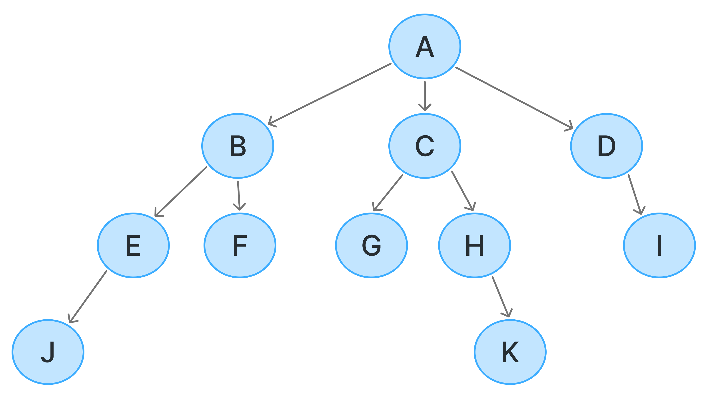

# ✍️ 작성자
<!-- 이름을 작성하세요 -->
한지성

---

# ❓ 질문
<!-- 면접 질문을 작성하세요 -->
DFS와 BFS에 대해 설명해주세요.

---

# 💬 답변 요약
<!-- 질문에 대한 간단한 답변을 적어주세요 -->

DFS는 Depth First Search의 약자로 깊이 우선 탐색을 의미하고, \
그래프의 시작 노드에서 출발하여 탐색할 한 쪽 분기를 정하여 최대 깊이까지 탐색을 마친 후 다른 쪽 분기로 이동하여 다시 탐색을 수행합니다. \
구현 시 재귀함수를 이용하므로 스택 오버플로에 유의해야 합니다. \
DFS 특징으로 한 정점을 계속해서 깊이 탐색하기 때문에 특정 조건에 해당하는 경로를 탐색하는 문제에 사용됩니다.

BFS는 Breadth First Search의 약자로 너비 우선 탐색을 의미하고, \
시작 노드에서 출발해 시작 노드를 기준으로 가까운 노드를 먼저 방문하면서 탐색을 수행합니다. \
너비 우선 탐색은 선입선출 방식으로 탐색하므로 큐를 이용해 구현됩니다. \
BFS는 탐색 시작 노드와 가까운 노드를 우선하여 탐색하므로 목표 노드에 도착하는 경로가 여러 개일 때 최단 경로를 보장하는 특징이 있습니다.

---

# 🧠 핵심 키워드
<!-- 답변을 위해 필요한 핵심 키워드를 적어주세요 -->
- 그래프 탐색 알고리즘
- 재귀 함수
- 스택
- 큐

---

# 🔥 상세 설명
<!-- 답변을 위해 필요한 CS 개념, 원리, 예시 등을 자세히 정리하세요 -->

탐색이란 많은 양의 데이터 중에서 원하는 데이터를 찾는 과정을 의미

### 깊이 우선 탐색 (DFS, Depth - First Search)

### DFS 탐색 순서 : A → B → E → J → F → C → G → H → K → D → I

---

DFS는 Depth - First Search, 깊이 우선 탐색이라고도 부르며, 그래프와 트리의 깊은 부분을 우선적으로 탐색하는 알고리즘 \
그림에서와 같이 갈 수 있는 한 끝까지 탐색해 리프 노드를 방문하고, 이전 갈림길로 돌아와 선택하지 않았던 노드를 방문하는 식으로 탐색 \
DFS는 스택(Stack) 자료구조를 이용

### 동작 방식
- 탐색 시작 노드를 스택에 삽입하고 방문 처리
- 스택의 최상단 노드에 방문하지 않은 인접 노드가 있으면 그 인접 노드를 스택에 넣고 방문 처리
- 방문하지 않은 인접 노드가 없으면 스택에서 최상단 노드를 꺼냄
- 과정을 더 이상 수행할 수 없을 때까지 반복

### 특징
- 탐색 방식: 한 경로를 끝까지 탐색하고, 더 이상 갈 곳이 없으면 돌아가서 새로운 경로를 탐색
- 자료구조: 스택 (재귀 호출로 스택을 대체하기도 함)
- 시간 복잡도: O(V + E) (V: 노드 수, E: 간선 수)
- 메모리: 경로를 저장하기 위해 스택을 사용하여 재귀 깊이에 따른 메모리 소비가 있다

### 사용 사례
- 미로 찾기: 모든 경로를 끝까지 탐색한 후 최적 경로를 찾기
- 위상 정렬: DFS를 이용해 위상 정렬 가능
- 그래프에서 사이클 탐지: DFS를 통해 그래프가 사이클을 포함하는지 탐지

### 너비 우선 탐색 (BFS, Breadth-First Search)

### DFS 탐색 순서 : A → B → C → D → E → F → G → H → I → J → K

---

BFS는 Breadth - First Search, 너비 우선 탐색이라고도 부르며, 그래프와 트리의 가까운 노드부터 탐색하는 알고리즘 \
그림에서와 같이 루트 노드와 같은 거리에 있는 노드를 우선으로 방문하며 탐색 \
BFS는 큐(Queue) 자료구조를 이용

### 동작 방식
- 탐색 시작 노드를 큐에 삽입하고 방문 처리
- 큐에서 노드를 꺼내 해당 노드의 인접 노드 중에서 방문하지 않은 노드를 모두 큐에 삽입하고 방문 처리
- 큐가 빌 때까지 반복

### 특징
- 탐색 방식: 시작 노드에서 가까운 노드를 우선적으로 탐색
- 자료구조: 큐 (선입선출 방식)
- 시간 복잡도: O(V + E) (V: 노드 수, E: 간선 수)
- 메모리: 큐를 사용하여 현재 탐색 중인 노드를 저장, 최악의 경우 모든 노드가 큐에 저장될 수 있음

### 사용 사례
- 최단 경로 탐색: BFS는 그래프에서 최단 경로를 찾는 데 유용(예: Dijkstra 알고리즘)
- 레벨 순회: 트리 구조에서 각 레벨의 노드를 순회할 때 사용

| 항목       | DFS (Depth-First Search)                | BFS (Breadth-First Search)            |
|------------|-----------------------------------------|---------------------------------------|
| 탐색 과정  | 시작 노드에서 출발하여 탐색할 한 쪽 분기를 정하여 최대 깊이까지 탐색 | 시작 노드에서 출발해 시작 노드를 기준으로 가까운 노드를 먼저 방문 |
| 특징       | 재귀 함수로 구현 스택 자료구조 이용                 | FIFO 탐색 Queue 자료 구조 이용             |
| 시간 복잡도| O(V + E)                | O(V + E)             |

---

# 🔗 참고 자료
<!-- 질문과 답변을 준비할 때 참고한 자료, 링크 등을 남겨주세요 -->

- 이것이 취업을 위한 코딩 테스트다 with 파이썬 - 나동빈 지음(한빛미디어)
- 이지스퍼블리싱 - Do it 알고리즘 코딩테스트
- [[알고리즘 이론] 탐색 알고리즘 - DFS / BFS (블로그)](https://sunho-doing.tistory.com/entry/%EC%95%8C%EA%B3%A0%EB%A6%AC%EC%A6%98-%ED%83%90%EC%83%89-%EC%95%8C%EA%B3%A0%EB%A6%AC%EC%A6%98-DFS-BFS)