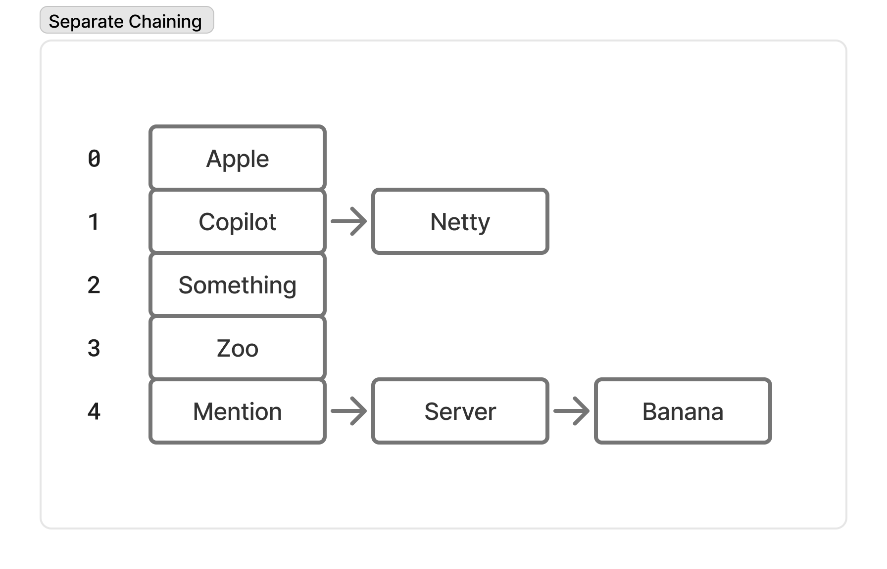
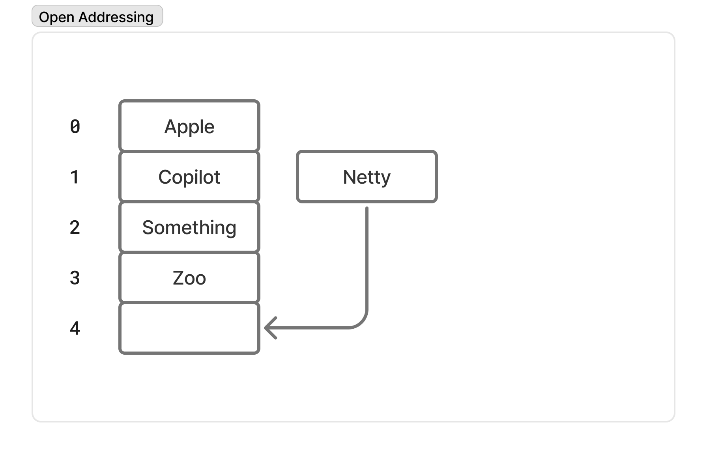

# ✍️ 작성자
김지수

# ❓ 질문
해시 테이블에서 충돌이 발생한 경우 어떻게 해결할 수 있는지 설명해주세요.

# 💬 답변 요약
- 해시 충돌을 해결하기 위한 대표적인 방법으로 분리 연결법과 개방 주소법이 있습니다.
- 분리 연결법은 충돌한 데이터를 같은 버킷 내 별도의 자료구조(보통 연결 리스트)로 저장합니다.
- 개방 주소법은 충돌 시 다른 빈 버킷을 찾아 저장합니다.
- 개방 주소법에는 선형 탐사, 이차 탐사, 이중 해싱 등의 변형이 있으며, 각 방법은 충돌 해결과 탐색 효율을 높이기 위해 다양한 증분 함수를 사용합니다.

# 🧠 핵심 키워드
- 해시 테이블(Hash Table)
- 해시 함수(Hash Function)
- 해시 충돌(Hash Collision)
- 분리 연결법(Separate Chaining)
- 개방 주소법(Open Addressing)

# 🔥 상세 설명
## 🔍 해시 함수의 필요성
- 해시 테이블은 키를 바로 인덱스로 사용하지 않고 해시 함수를 이용해 배열의 인덱스를 계산하는 자료구조입니다.
- 키를 바로 인덱스로 사용하지 않는 이유는 크게 두 가지입니다.
    - 키는 숫자뿐만 아니라 문자열, 객체 등 다양한 타입일 수 있습니다.
    - 키가 숫자라도 값이 매우 넓게 분포된 경우(예: 1, 1000, 1000000) 배열의 대부분이 비어 있게 되는 메모리 낭비가 발생할 수 있습니다.
- 따라서 해시 함수는 이러한 키들을 정수 해시값으로 변환하고, 이를 배열 크기에 맞게 분산시켜 효율적이고 공간 낭비 없이 데이터를 저장할 수 있게 합니다.

## 💥 해시 충돌(Hash Collision)
- 해시 함수는 서로 다른 입력에 대해 같은 해시 값을 반환할 수 있는데, 이를 충돌이라고 합니다.
- 해시 테이블에서 충돌이 발생하면, 여러 키가 같은 버킷에 할당되어 데이터 구조와 성능에 영향을 줍니다.

## 🧩 분리 연결법(Separate Chaining)
### 📝 개념
- 충돌한 요소들을 같은 버킷 내 별도의 자료구조에 저장하는 방법입니다. 일반적으로 연결 리스트를 사용합니다.
- 이 경우 해시 테이블에서 요소를 찾는 시간은 버킷 접근 시간(상수)과 버킷 내 리스트 탐색 시간의 합입니다.

### ⚙️ 성능
- 연결 리스트에서의 탐색은 최악의 경우 O(n)이 되므로, 충돌이 잦으면 성능이 떨어질 수 있습니다.
- 리스트 대신 트리 등의 더 효율적인 자료구조를 사용할 수 있습니다.

## 🗄️ 개방 주소법(Open Addressing)
### 📝 개념
- 충돌이 발생하면 다른 빈 버킷을 찾아 데이터를 저장하는 방식입니다.
- 충돌 처리 시 해시 함수 결과에 증분 함수 p(i)를 더해 다음 탐색 위치를 결정합니다. 여기서 i는 시도 횟수입니다.

### 🔄 탐색 방식
- 조회 시에도 같은 방법으로 충돌한 키들을 순차적으로 비교하며 찾습니다.
- 최악의 경우 시간 복잡도는 O(n)입니다.

### 🧮 증분 함수 종류
- 선형 탐사(Linear Probing): p(i) = i
- 이차 탐사(Quadratic Probing): p(i) = i²
- 이중 해싱(Double Hashing): p(i) = i × h’(K), h’은 키 K에 대한 추가 해시 함수

## ⚙️ 기타 충돌 해결법
### 🍚 쿡쿠 해싱(Cuckoo Hashing)
- 두 개 이상의 해시 함수를 사용해 키를 여러 위치 중 한 곳에 저장하며, 충돌 시 기존 키를 다른 위치로 이동시켜 해결합니다.
- 충돌 해결과 조회 속도 면에서 효율적입니다.

# 🔗 참고 자료
- [1] https://www.baeldung.com/cs/hash-tables
- [2] https://www.baeldung.com/cs/hashing#2-collisions
- [3] https://www.baeldung.com/cs/hashing-separate-chaining
- [4] https://www.baeldung.com/cs/cuckoo-hashing
- [5] https://www.baeldung.com/cs/hashing-linear-probing