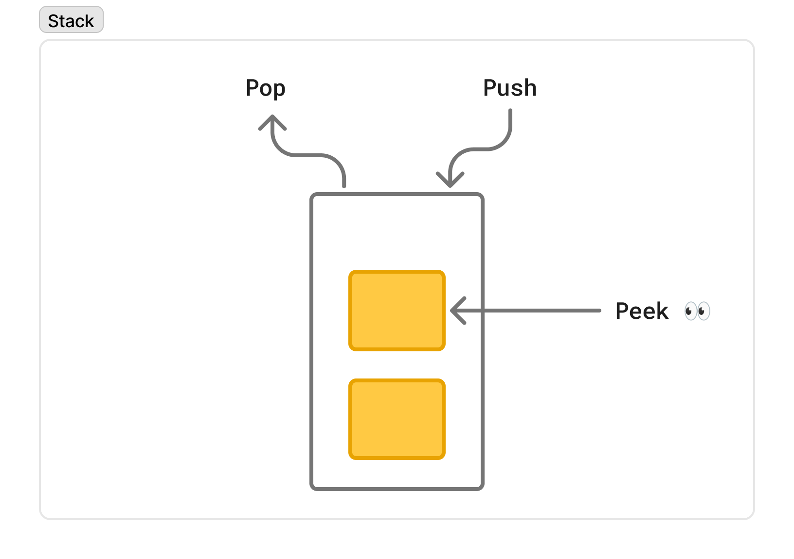
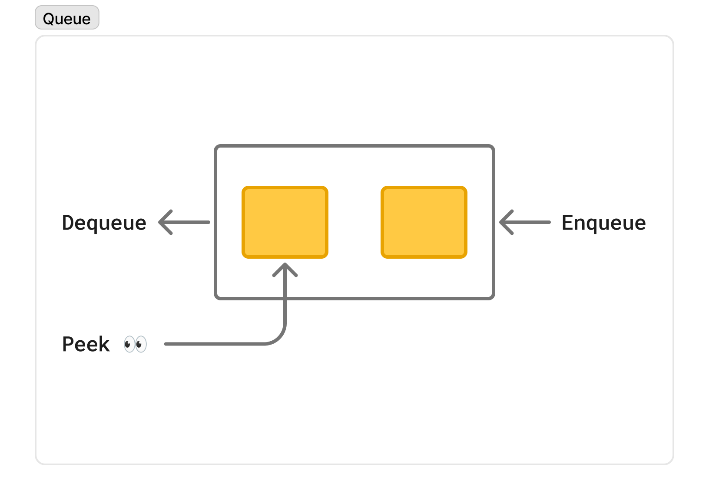

# ✍️ 작성자
<!-- 이름을 작성하세요 -->
김지수

---

# ❓ 질문
<!-- 면접 질문을 작성하세요 -->
스택과 큐를 비교해주세요.

---

# 💬 답변 요약
<!-- 질문에 대한 간단한 답변을 적어주세요 -->
- 스택은 `후입선출` 원칙을 따르는 자료구조입니다.
- 큐는 `선입선출` 원칙을 따르는 자료구조입니다.

---

# 🧠 핵심 키워드
<!-- 답변을 위해 필요한 핵심 키워드를 적어주세요 -->
- LIFO(Last In, First Out)
- FIFO(First In, First Out)

---

# 🔥 상세 설명
<!-- 답변을 위해 필요한 CS 개념, 원리, 예시 등을 자세히 정리하세요 -->
- 스택과 큐는 데이터를 관리하는 컨테이너 객체를 나타냅니다`[1]`.
- 스택과 큐는 데이터를 저장하고 꺼내는 순서에 차이가 있는 선형 자료구조입니다`[2]`.
    - 스택은 나중에 저장된 데이터를 먼저 꺼냅니다.
    - 큐는 먼저 저장된 데이터를 먼저 꺼냅니다.

|        항목        | 스택                                         | 큐                                         |
|:----------------:|:-------------------------------------------|:------------------------------------------|
|      동작 원리       | 후입선출, LIFO(Last In, First Out)             | 선입선출, FIFO(First In, First Out)           |
|      주요 연산       | push(), pop(), peek()                      | enqueue(), dequeue(), peek()              |
|      사용 목적       | 최근에 저장된 데이터를 우선 처리                         | 먼저 저장된 데이터를 우선 처리                         |
|      실생활 예시      | 책 쌓기                                       | 줄 서기                                      |
| 활용 예시`[2][3][4]` | 함수 호출 스택, DFS, 브라우저 뒤로 가기, 괄호 검사, Undo, 재귀 | 데이터 비동기 전송, CPU/디스크 스케줄링, BFS, 작업의 공정한 분배 |
|   시간 복잡도`[5]`    | O(1)                                       | O(1)                                      |
| 다이어그램 |                  |                  |

---

# 🔗 참고 자료
<!-- 질문과 답변을 준비할 때 참고한 자료, 링크 등을 남겨주세요 -->
- [1] https://www.baeldung.com/cs/data-type-vs-data-structure#1-common-data-structures
- [2] https://www.baeldung.com/cs/common-data-structures#stacks-queues
- [3] https://www.programiz.com/dsa/stack
- [4] https://www.programiz.com/dsa/queue
- [5] https://www.baeldung.com/cs/complexity-stack-queue-deque-set#comparison
- https://www.baeldung.com/cs/stack-data-structure
- https://www.baeldung.com/java-queue
- https://www.baeldung.com/cs/types-of-queues
- https://www.baeldung.com/cs/queue-two-stacks-simulate