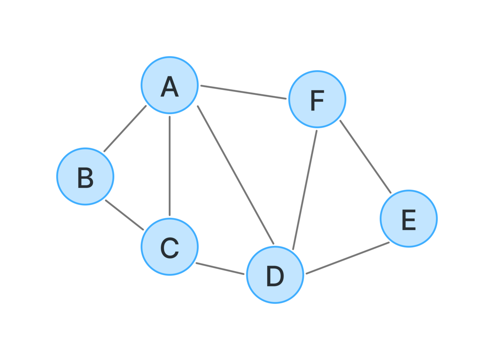
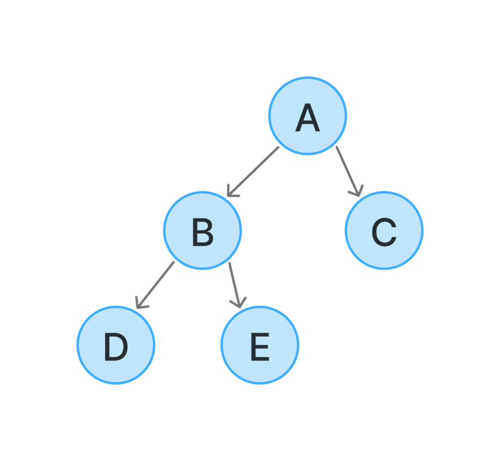

# ✍️ 작성자
<!-- 이름을 작성하세요 -->
한지성

---

# ❓ 질문
<!-- 면접 질문을 작성하세요 -->
그래프와 트리에 대해 설명해주세요

---

# 💬 답변 요약
<!-- 질문에 대한 간단한 답변을 적어주세요 -->
그래프는 노드와 노드를 연결해 주는 엣지로 구성되어 연결된 노드 간의 관계를 표현할 수 있는 자료구조입니다. \
순환구조를 가질 수 있으며, 방향성이 있는 그래프와 방향성이 없는 그래프로 나눌 수 있습니다.

트리는 그래프의 일종으로 노드 간의 관계가 계층적이고 방향성이 있는 비순환 그래프입니다. \
사이클을 형성하지 않고 부모-자식 관계를 가지며 모든 노드가 하나의 루트 노드를 가지는 특징이 있습니다.

---

# 🧠 핵심 키워드
<!-- 답변을 위해 필요한 핵심 키워드를 적어주세요 -->
- 노드
- 엣지
- 사이클

---

# 🔥 상세 설명
<!-- 답변을 위해 필요한 CS 개념, 원리, 예시 등을 자세히 정리하세요 -->

### 그래프 (Graph)
- 그래프는 노드라는 점과 노드를 연결해 주는 선인 엣지로 이루어진 자료구조
- 연결된 노드로 관계를 표현할 수 있는 구조
- 방향성이 있는 그래프와 방향성이 없는 그래프로 나눌 수 있음
- 2개 이상의 경로 가능 (무방향, 방향, 양방향 가능)

### 트리 (Tree)
- 그래프와 같이 노드와 노드 사이를 연결하는 간선으로 이루어진 자료구조
- 두 개의 노드 사이에 반드시 1개의 경로만을 가지며 사이클이 존재하지 않는 방향 그래프
- 사이클 존재 X

| 항목       | 그래프                          | 트리                             |
|------------|----------------------------------|-----------------------------------|
| 방향성     | 방향, 무방향                   | 방향만                            |
| 사이클     | 순환, 비순환, 자기순환          | 비순환만                          |
| 루트노드   | 루트 개념 없음                  | 한 개의 루트 존재                |
| 부모-자식  | 부모-자식 개념 없음             | 1개의 부모노드(루트 제외)        |
| 간선 수    | 자유                            | N - 1개                           |

---

# 🔗 참고 자료
<!-- 질문과 답변을 준비할 때 참고한 자료, 링크 등을 남겨주세요 -->
- [[기술 면접 준비] 자료구조 - 그래프와 트리의 차이 (블로그)](https://velog.io/@jjh0526/%EA%B8%B0%EC%88%A0-%EB%A9%B4%EC%A0%91-%EC%A4%80%EB%B9%84-%EC%9E%90%EB%A3%8C%EA%B5%AC%EC%A1%B0-%EA%B7%B8%EB%9E%98%ED%94%84%EC%99%80-%ED%8A%B8%EB%A6%AC%EC%9D%98-%EC%B0%A8%EC%9D%B4)
- [[Data Structure] 트리(Tree)와 그래프(Graph) 이해하기 (블로그)](https://kangworld.tistory.com/37)
- [[자료구조] 그래프와 트리(Graph, Tree) (블로그)](https://bigsong.tistory.com/33)