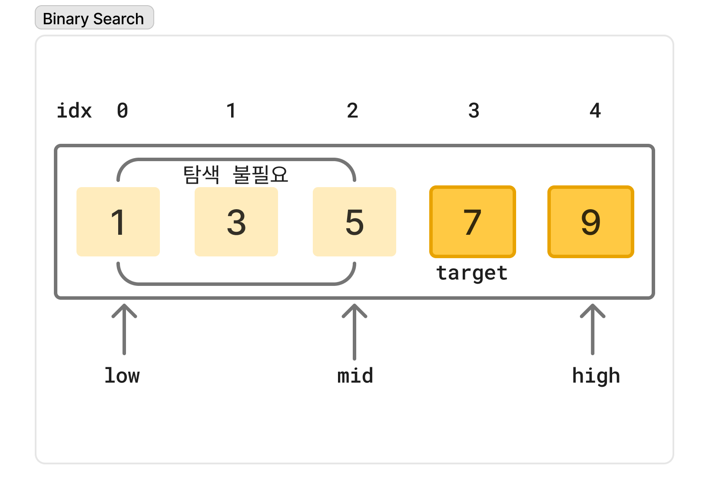

# ✍️ 작성자
김지수

---

# ❓ 질문
이진 탐색 알고리즘에 대해 설명해주세요.

---

# 💬 답변 요약
이진 탐색은 정렬된 배열에서 탐색 범위를 반씩 줄여가며 원하는 값을 효율적으로 찾는 알고리즘입니다.

---

# 🧠 핵심 키워드
- 정렬된 배열
- 분할 정복

---

# 🔥 상세 설명

## 📌 개요`[1]`
- 이진 탐색은 정렬된 배열에서 특정 값을 빠르게 찾기 위한 알고리즘입니다.
- 입력 배열은 비교 가능한 요소들로 정렬되어야 합니다.

## 🤖 알고리즘`[2]`
- 이진 탐색은 찾고자 하는 값 x와 정중앙의 요소 arr\[mid\]를 비교하며 범위를 절반씩 줄여나가는 방식입니다.
    - x < arr\[mid\] -> 왼쪽 하위 배열 탐색
    - x > arr\[mid\] -> 오른쪽 하위 배열 탐색
    - x = arr\[mid\] -> mid 반환



```
algorithm BinarySearch(arr, x):
    // INPUT
    //     arr = 오름차순 정렬된 배열
    //     x = 타겟
    // OUTPUT
    //     x가 arr 안에 존재하는 경우 x의 인덱스, 존재하지 않는 경우 'failure'

    low <- 0
    high <- n - 1
    mid <- (low + high) / 2 // low + (high - low) / 2으로 대체 가능

    while low <= high:
        if x < arr[mid]:
            // arr[mid], ..., arr[high]의 모든 요소들이 타겟 x보다 큼
            high <- mid - 1 // 왼쪽 하위 배열 탐색
        else if x > arr[mid]:
            // arr[low], ..., arr[mid]의 모든 요소들이 타겟 x보다 작음
            low <- mid + 1 // 오른쪽 하위 배열 탐색
        else:
            // x = arr[mid] // 타겟 x 발견
            return mid
            
        mid <- (low + high) / 2 // low + (high - low) / 2으로 대체 가능

   // x not in arr
   return 'failure'
```

## 🤯 복잡도`[3]` 

### ⏰ 시간 복잡도
- 이진 탐색은 매 반복마다 탐색 범위가 절반으로 감소합니다.
- 각 반복에서의 비교 연산은 O(1)이므로 전체 시간 복잡도는 `O(log n)`입니다.

### 🌍 공간 복잡도
- 구현 방식(반복문 vs 재귀)에 따른 추가 공간 복잡도는 아래와 같습니다.
- 이진 탐색을 위해 n개의 데이터를 저장하는 배열 공간이 필요하므로, 전체 공간 복잡도는 `O(n)`입니다.

|구현 방식|추가 공간 복잡도| 설명                          |
|:---:|:---:|:----------------------------|
|반복문|O(1)| low, high, mid 등 소수의 변수만 사용 |
|재귀|O(log n)| 재귀 호출로 인해 스택 공간 사용      |

---

# 🔗 참고 자료
- [1] https://www.baeldung.com/cs/binary-search-complexity#binary-search
- [2] https://www.baeldung.com/cs/binary-search-complexity#the-algorithm
- [3] https://www.baeldung.com/cs/binary-search-complexity#complexity