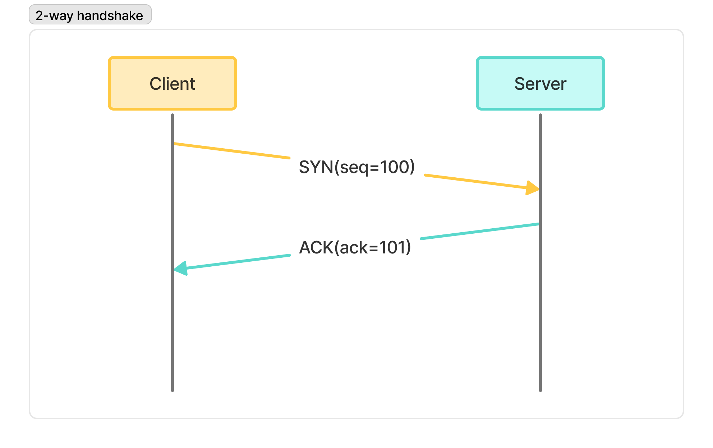
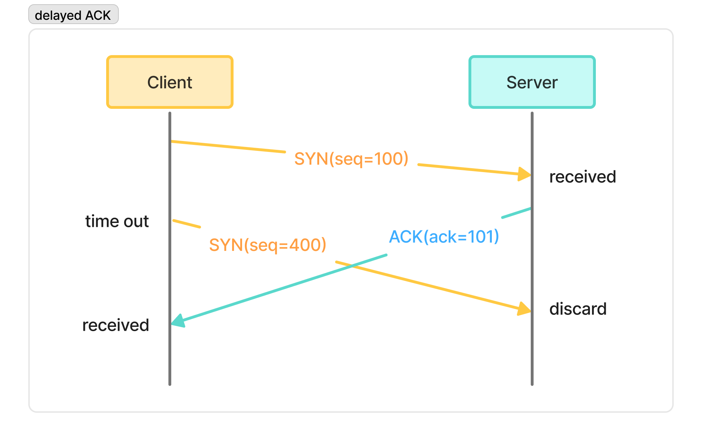
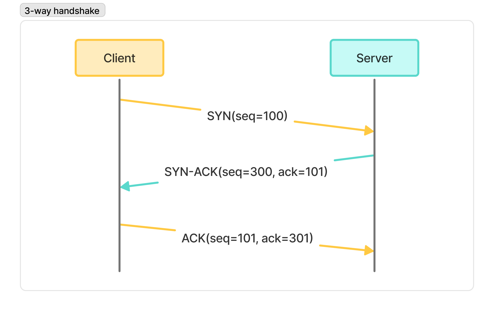

# ✍️ 작성자
김지수

---

# ❓ 질문
3-way handshake란 무엇인가요?

---

# 💬 답변 요약
TCP 연결을 설정하는 표준 프로토콜로, 클라이언트와 서버가 세 번의 메시지(SYN → SYN-ACK → ACK)를 교환하여 서로의 상태를 확인하고 안정적인 통신을 시작하는 과정이다.   
이 방식은 단순한 양방향(2-way) 핸드셰이크의 문제점을 해결하며, 연결 신뢰성과 데이터 전달의 정확성을 보장한다.

---

# 🧠 핵심 키워드
TCP, 2-way handshake, 3-way handshake, SYN, ACK, 시퀀스 번호, 프로토콜

---

# 🔥 상세 설명

## 🤝 핸드셰이크란?
핸드셰이크는 장치나 프로세스가 서로 통신을 시작하기 전에, 연결 조건(메시지 전송 방식, 인코딩, 전송 속도 등)을 협상하는 과정이다.  
이를 통해 통신 참여자 모두가 합의한 매개변수와 규칙에 따라 안정적으로 데이터를 교환할 수 있다.  

| 프로토콜                                   | 핸드셰이크 목적 및 특징                                              |  
|:---------------------------------------|:-----------------------------------------------------------|  
| TCP(전송 제어 프로토콜)                        | 3-way handshake로 두 당사자 간 메시지 교환을 동기화하여 안정적인 통신 구축          |  
| TLS(전송 계층 보안)                          | 특정 연결에 대한 보안 기능(암호화 알고리즘, 키 등) 정의                          |  
| SMTP(단순 메일 전송 프로토콜)                    | 서버와 사용자 인증, 암호화 프로토콜, 최대 메시지 크기 등 협의                       |  
| Dial-up Internet Access(전화선 기반 인터넷 접속) | 통신 프로토콜 정의, 에코 억제 기능 비활성화, 적절한 변조 방식 선택, 연결 최적화            |

## 2️⃣ 양방향 핸드셰이크(2-way handshake)

### 🧩 개요
양방향 핸드셰이크는 통신을 원하는 두 당사자 간의 연결을 생성하는 간단한 프로토콜이다.  
SYN(동기화) 메시지와 ACK(확인) 메시지를 사용한다.

### 📝 절차
- 클라이언트가 SYN(seq=X)을 전송한다.
- 서버가 ACK(ack=X+1)를 응답한다.

### ⚠️ 문제
이 방식은 간단하지만 서버의 ACK 응답이 지연될 경우 시퀀스 번호 불일치로 오류가 발생할 수 있다.  

1. 클라이언트가 SYN(seq=100)을 전송한다.
2. 서버는 ACK(ack=101)를 전송하지만, 네트워크 지연으로 인해 늦게 도착한다.
3. 클라이언트는 타임아웃으로 인해 연결 실패로 간주하고, 새로운 SYN(seq=400)을 전송한다.
4. 서버는 이전 SYN(seq=100)에 대한 ACK를 이미 보냈기 때문에, 새로운 SYN(seq=400)은 무시한다.
5. 지연된 ACK(ack=101)가 클라이언트에 도착한다.
6. 클라이언트는 이 ACK를 방금 보낸 SYN(seq=400)에 대한 응답으로 착각한다.
7. 클라이언트는 seq=401부터 데이터를 전송하지만, 서버는 seq=101 이후의 데이터를 기대한다. 시퀀스 번호 불일치로 인해 통신 오류가 발생한다.

## 3️⃣ 세 방향 핸드셰이크(3-way handshake)

### 🧩 개요
세 방향 핸드셰이크도 양방향 핸드셰이크와 마찬가지로 SYN과 ACK 메시지를 사용해 두 당사자 간 연결을 설정한다.  
서버와 클라이언트는 각각 시퀀스 번호를 제공하는 것뿐만 아니라, 서로의 시퀀스 번호를 확인한다.  
이로 인해 SYN 중복 오류 발생을 방지할 수 있다.  

### 📝 절차
- 클라이언트가 SYN(seq=X)을 전송한다.
- 서버가 SYN-ACK(seq=Y, ack=X+1)를 응답한다.
- 클라이언트가 ACK(seq=X+1, ack=Y+1)를 전송한다.

---

# 🔗 참고 자료
- [Baeldung - Two-Way Handshake and Three-Way Handshake](https://www.baeldung.com/cs/handshakes)
- [Baeldung - SYN/ACK in the TCP Protocol](https://www.baeldung.com/cs/tcp-protocol-syn-ack)