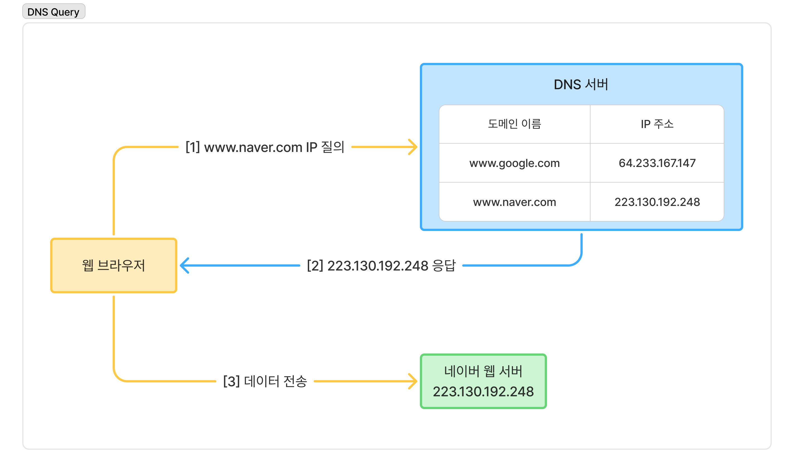

# ✍️ 작성자
김지수

---

# ❓ 질문
DNS는 무엇이고 어떤 역할을 하나요?

---

# 💬 답변 요약
DNS는 Domain Name System의 약자로, 도메인 이름을 IP 주소로 변환하는 역할을 수행한다.

---

# 🧠 핵심 키워드
도메인 이름, IP 주소

---

# 🔥 상세 설명

## 🌐 DNS
인터넷 통신을 위해서는 대상 서버의 IP 주소를 알아야 한다.  
그러나 사용자가 숫자 형태의 IP 주소를 직접 기억하거나 사용하는 것은 불편하다.  
따라서 IP 주소에 기억하기 쉬운 이름을 붙이는데, 이것을 `도메인 이름(Domain Name)`이라고 한다.  
`DNS(Domain Name System)`는 사람이 이해하기 쉬운 `도메인 이름`을 컴퓨터가 이해할 수 있는 `IP 주소`로 바꿔주는 시스템이다.

## 🔍 DNS 질의 흐름
- 사용자가 웹 브라우저에 `www.naver.com`을 입력한다.
- 웹 브라우저는 DNS 서버에 `www.naver.com`의 IP 주소를 질의한다.
- DNS 서버는 `www.naver.com`에 대응하는 IP 주소를 응답한다.
- 웹 브라우저는 응답으로 받은 IP 주소에 패킷을 전송한다.

> 참고로 `도메인 이름 : IP 주소 = 1 : 1`인 것은 아니다. 여러 개의 IP 주소가 하나의 도메인 이름에 매핑될 수 있다.  
> 이것의 이유 중 하나는 `부하 분산`에 있다. DNS 서버가 등록된 IP를 번갈아 제공하기 때문에 여러 서버에 분산해서 요청을 보내게 된다.

## 📛 도메인 이름 
도메인 이름은 `계층 구조`를 가진다.  
- 각 계층은 점(.)으로 구분된다.
- 왼쪽이 하위 계층, 오른쪽이 상위 계층이다. 따라서 가장 오른쪽이 `최상위 도메인(Top-Level Domain; TLD)`이 된다.

### 💼 일반 최상위 도메인
일반 최상위 도메인에서는 두 번째 계층인 2차 도메인이 도메인의 주요 이름이 된다.  
예를 들어 naver.com의 주요 이름은 2차 도메인에 해당하는 naver이다.  

### 🌍 국가 최상위 도메인
국가 최상위 도메인은 두 번째 계층까지 미리 정의되어 있다.  
예를 들어 한국에서 교육 기관은 ac.kr을, 기업은 co.kr을 사용한다.  
따라서 국가 최상위 도메인에서는 세 번째 계층이 도메인의 주요 이름이 된다.

---

# 🔗 참고 자료
- [Baeldung - Introduction to the Domain Name System (DNS)](https://www.baeldung.com/cs/dns-intro)
- Behrouz A. Forouzan, 데이터 통신과 네트워킹, 한티미디어(2021)
- 최범균, 주니어 백엔드 개발자가 반드시 알아야 할 실무 지식, 한빛미디어(2025)