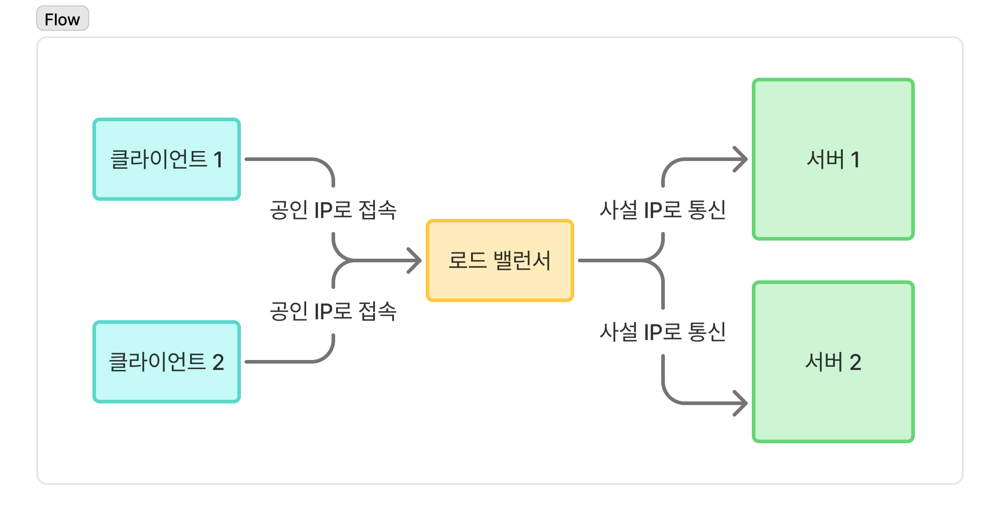
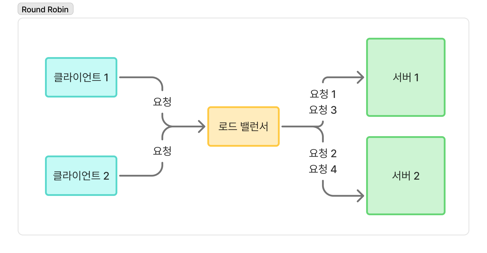
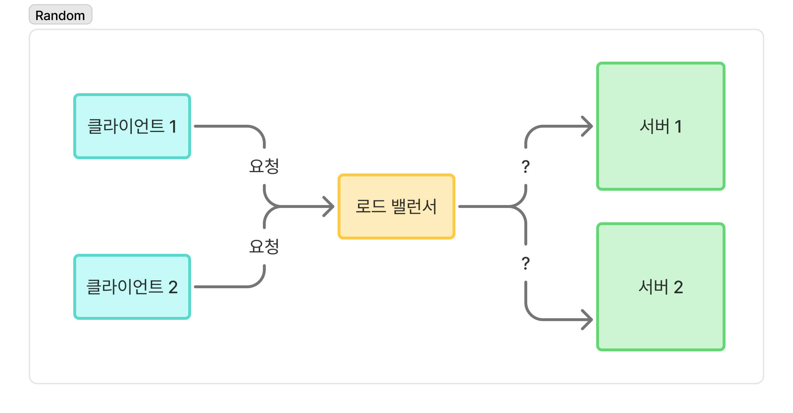
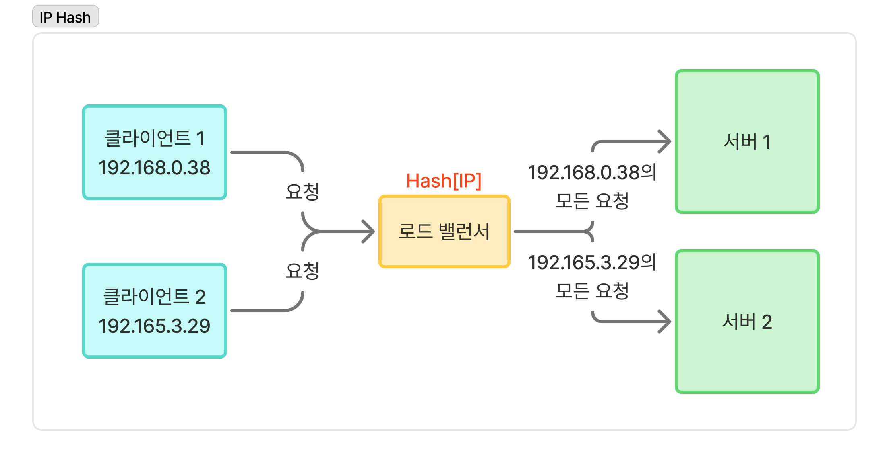
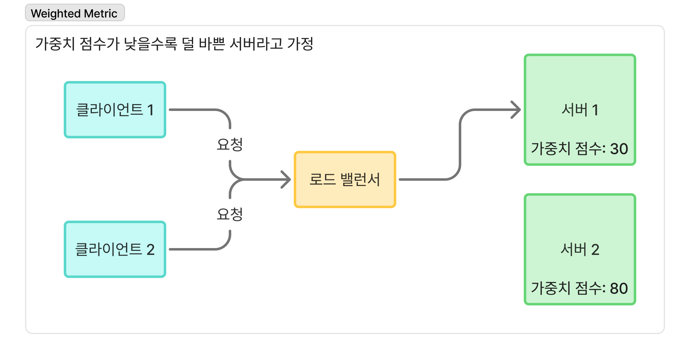

# ✍️ 작성자
김지수

---

# ❓ 질문
로드 밸런싱이 무엇이고, 어떻게 동작하는지 설명해주세요.

---

# 💬 답변 요약 
로드 밸런싱은 하나의 서버에 집중되는 트래픽을 여러 서버로 분산시켜 시스템의 부하를 고르게 나누는 기술이다.  
클라이언트가 로드 밸런서의 공인 IP로 요청을 보내면, 로드 밸런서는 사설 네트워크의 여러 웹 서버로 요청을 분산하여 처리한다.  
이때 요청을 처리할 서버를 선택하기 위해 다양한 알고리즘이 사용된다.

---

# 🧠 핵심 키워드
로드 밸런싱, 스케일 아웃, 트래픽 분산, 가용성, 장애 복구, 로드 밸런싱 알고리즘, 공인/사설 IP

---

# 🔥 상세 설명

## ⚙️ 로드 밸런싱의 개념
로드 밸런싱은 과도한 트래픽이나 요청이 한 서버에 집중되지 않도록 `부하를 여러 서버에 나누는 기술`이다.  
로드 밸런싱을 통해 얻을 수 있는 이점은 다음과 같다:  
- `고가용성`  
  웹 서버 중 하나가 다운되면, 로드 밸런서는 해당 서버로의 요청을 중단하고 정상 서버로 트래픽을 분산한다.  
  이로 인해 웹 계층 전체의 중단을 방지하고 가용성을 확보할 수 있다.
- `확장성`  
  트래픽이 급증하면 서버를 추가하기만 하면 되고, 로드 밸런서는 자동으로 새로운 서버까지 트래픽을 분산한다.
- `성능`  
  하나의 서버에 부하가 집중되지 않도록 하여 각 서버가 안정적으로 트래픽을 처리할 수 있어 응답 속도와 시스템 안정성이 향상된다.
- `보안`    
  로드 밸런서에 보안 기능이 내장되어 있어 디도스 공격을 처리하는 데 유용하다.  
  이외에도 트래픽을 모니터링하고 악성 콘텐츠를 차단하거나, 공격 트래픽을 여러 백엔드 서버로 자동 리디렉션하여 영향을 최소화할 수 있다.

## 🏃 로드 밸런싱의 작동
1. 클라이언트는 로드 밸런서의 `공인 IP 주소`로 요청을 보낸다.  
2. 로드 밸런서는 내부에 있는 웹 서버들 중 하나를 선택해 요청을 전달한다. 이때 내부적으로 `사설 IP 주소`를 이용해 통신한다. 
3. 웹 서버는 응답을 로드 밸런서로 다시 보내고, 로드 밸런서는 클라이언트에게 응답을 전달한다.  

📌 실제 클라이언트는 웹 서버들과 직접 통신하지 않으며, 보안성과 관리 편의성도 향상된다.

## 📤 로드 밸런싱 알고리즘
로드 밸런싱 알고리즘은 로드 밸런서가 클라이언트 요청에 가장 적합한 서버를 결정하기 위해 따르는 규칙 집합이다.  
로드 밸런싱 알고리즘은 `서버의 현재 상태를 고려하는지`에 따라 `정적 로드 밸런싱`과 `동적 로드 밸런싱`으로 분류할 수 있다.

### 🧊 정적 로드 밸런싱 알고리즘
정적 로드 밸런싱 알고리즘은 고정된 규칙을 따르며 현재 서버 상태와 무관하다.  
예시로는 Round Robin, Random, IP Hash 등이 있다.

| Round Robin                           | Random                           | IP Hash                             |
|:--------------------------------------|:---------------------------------|:------------------------------------|
| 요청을 각 서버에 순서대로 분배                     | 요청을 처리할 서버를 무작위로 선택              | 클라이언트 IP를 해싱해 특정 서버에 고정되도록 요청 분배    |
| 구현이 간단하지만 서비스를 최적으로 활용하지 못할 수 있음      | 구현이 간단하지만 서비스를 최적으로 활용하지 못할 수 있음 | 서버 고정성이 중요할 때 유용하지만 장애에 대한 내결함성이 낮음 |
|  |      |        |

### 🔄 동적 로드 밸런싱 알고리즘
동적 로드 밸런싱 알고리즘은 트래픽을 배포하기 전에 서버의 현재 상태를 검사한다.   
예시로는 Least Connections, Weighted Metric 등이 있다.

| Least Connections                                 | Weighted Metric                                          |
|:--------------------------------------------------|:---------------------------------------------------------|
| 현재 커넥션 수가 가장 적은 서버에 요청 할당                         | 서버의 부하와 관련된 메트릭(CPU, 메모리 사용량 등)을 수집하고 가중치를 계산해 최적의 서버 선택 |
| 일반적으로 서비스 활용도를 더 최적화하지만 구현이 복잡함                   | 일반적으로 서비스 활용도를 더 최적화하지만 구현이 복잡함                          |
|  |             |

---

# 🔗 참고 자료
- [AWS - 로드 밸런싱이란 무엇인가요?](https://aws.amazon.com/ko/what-is/load-balancing/)
- [Baeldung - How Does a Load Balancer Work?](https://www.baeldung.com/cs/load-balancer)
- [Baeldung - Introduction to Spring Cloud Load Balancer](https://www.baeldung.com/spring-cloud-load-balancer)
- 이준형, 「이것이 취업을 위한 백엔드 개발이다 with 자바」, 한빛미디어(2024)
- 알렉스 쉬, 「가상 면접 사례로 배우는 대규모 시스템 설계 기초」, 인사이트(2021)